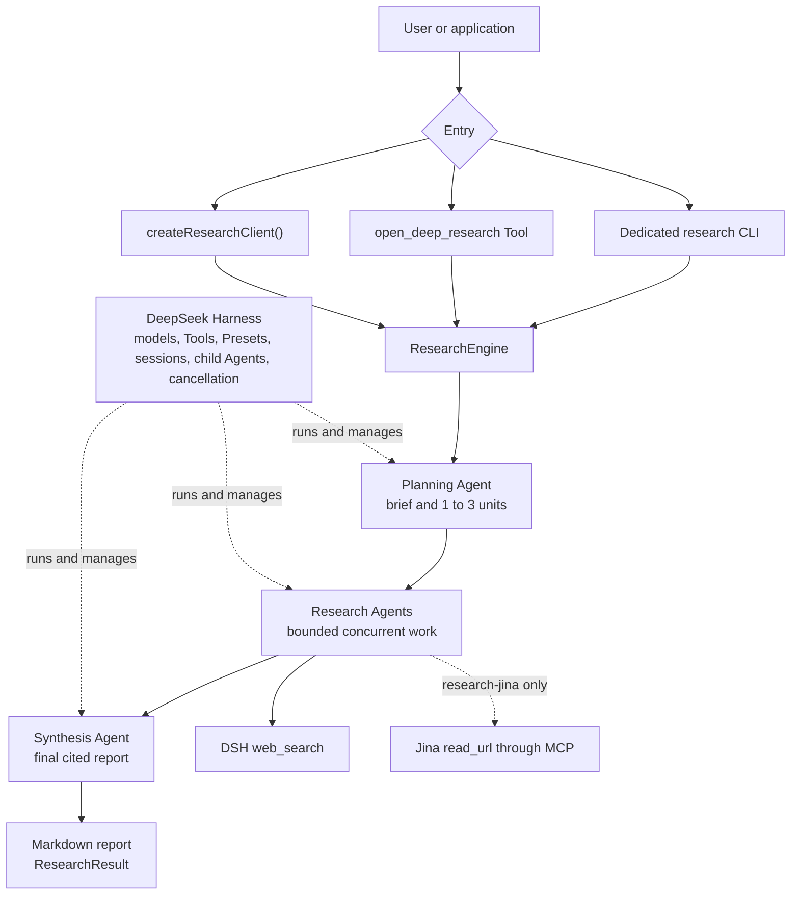

# 🔬 DSH Open Deep Research

[简体中文](./README.zh-CN.md)

DSH Open Deep Research is an open-source Deep Research agent and TypeScript framework built on [DeepSeek Harness](https://github.com/deepseek-ai/deepseek-harness). It accepts a research question, produces a Markdown report with citation links, and exposes the same research service through a CLI, a DSH Tool, and a programmatic API.

> **Project status:** `0.1.0-alpha.5` development candidate tested with published DSH `0.1.0-rc.8`. Alpha.5 has not been released or published to npm.

## What it does

- Plans one to three focused research units, runs them through DSH child Agents, and synthesizes their findings.
- Supports Web search in both dedicated Profiles and selected page or PDF reading in `research-jina`.
- Returns a cited Markdown report, normalized links, terminal status, and run metadata.
- Provides CLI, DSH Tool, and TypeScript entry points over a replaceable `ResearchEngine`.

## 🏗️ Architecture



All entry points call the same `ResearchEngine`. The active Profile selects the source Tools available to Research Agents. See [Architecture](./docs/architecture.md) for lifecycle, Profile composition, configuration, and result semantics.

## 🚀 Quickstart

Build the current development package from source. The packaged commands below use the resulting `dsh-open-deep-research-0.1.0-alpha.5.tgz`.

| Profile         | Source capabilities         | Credentials               | Network requirement            |
| --------------- | --------------------------- | ------------------------- | ------------------------------ |
| `research-jina` | Search and page/PDF reading | DeepSeek Key and Jina Key | DeepSeek API and `mcp.jina.ai` |
| `research`      | Search only                 | DeepSeek Key              | DeepSeek API                   |

Requirements: Node.js `^22.19.0` or `>=24.0.0`, pnpm `10.x` available on `PATH`, and DeepSeek Harness `0.1.0-rc.8`.

DSH also calls `pnpm` when it manages Profile plugins. Confirm that both `npx` and `pnpm` are available before installation:

```bash
node --version
pnpm --version
```

See the [pnpm installation guide](https://pnpm.io/installation) if the second command is unavailable.

### 1. Build the package

```bash
git clone https://github.com/songyang0603/dsh-open-deep-research.git
cd dsh-open-deep-research
pnpm install --frozen-lockfile
pnpm pack
```

This creates `dsh-open-deep-research-0.1.0-alpha.5.tgz` in the repository root. A release-asset Quickstart will replace this source build when Alpha.5 is published.

`plugin add` can print host peer warnings. Continue with initialization when the command exits with code `0`.

### 2. Full Research: search and read sources (recommended)

`research-jina` provides Web search and page reading. It sends selected public URLs to Jina without browser cookies. Use public, non-sensitive URLs and avoid signed, authenticated-session, private-network, or internal URLs.

Set both keys:

```bash
export DEEPSEEK_API_KEY='<your-deepseek-key>'
export JINA_API_KEY='<your-jina-key>'
```

```bash
npx @deepseek-ai/dsh@0.1.0-rc.8 plugin --profile research-jina add \
  ./dsh-open-deep-research-0.1.0-alpha.5.tgz

npx @deepseek-ai/dsh@0.1.0-rc.8 plugin --profile research-jina exec \
  dsh-open-deep-research-init --reader jina

npx @deepseek-ai/dsh@0.1.0-rc.8 --profile research-jina \
  --breadth balanced \
  --language English \
  "Research the main changes in DeepSeek Harness rc.8. Search for relevant material, read important source pages, and produce a report with citation links."
```

Research Agents choose which source Tools to call. The Profile provides both Tools without requiring a fixed number of calls. The Reader returns at most 8,000 tokens per request, so long documents can be truncated. If Jina initialization does not complete, check whether the deployment network can reach `mcp.jina.ai` or use the search-only Profile below.

### 3. Search-only: DeepSeek Key only

Use the independent `research` Profile when a Jina Key or network path is unavailable. It keeps planning, Web search, multiple research units, synthesis, and report generation. It does not provide reliable access to full page or PDF bodies.

```bash
export DEEPSEEK_API_KEY='<your-deepseek-key>'

npx @deepseek-ai/dsh@0.1.0-rc.8 plugin --profile research add \
  ./dsh-open-deep-research-0.1.0-alpha.5.tgz

npx @deepseek-ai/dsh@0.1.0-rc.8 plugin --profile research exec \
  dsh-open-deep-research-init

npx @deepseek-ai/dsh@0.1.0-rc.8 --profile research \
  --language English \
  "Research the main changes in DeepSeek Harness rc.8 and produce a report."
```

### 4. Save the output

Markdown mode writes the report to stdout, so it can be redirected to a file:

```bash
npx @deepseek-ai/dsh@0.1.0-rc.8 --profile research-jina \
  "Compare two research approaches" > report.md
```

The first clean `npx @deepseek-ai/dsh` invocation can spend several minutes downloading and building dependencies with little output. Wait for it to exit before retrying. The two Profiles are independent and never overwrite or automatically downgrade into each other.

## ⚙️ Configuration

| Option       | Values                                                   | Default           |
| ------------ | -------------------------------------------------------- | ----------------- |
| `--purpose`  | Free text                                                | omitted           |
| `--context`  | Free text                                                | omitted           |
| `--breadth`  | `focused`, `balanced`, `broad`                           | `balanced`        |
| `--format`   | `report`, `brief`, `memo`                                | `report`          |
| `--language` | Language name or locale                                  | question language |
| `--json`     | Canonical `ResearchResult` for completed or partial runs | off               |

Breadth sets the maximum number of research units to one, two, or three. Planning can choose fewer. Provider settings such as model route, Preset, working directory, source Tool allow-list, and maximum research concurrency are documented in [Architecture](./docs/architecture.md#provider-configuration).

Completed and partial runs exit with code `0`; a partial run also writes a concise notice to stderr. Execution failures use `1`, argument errors use `2`, and user interruption uses `130`. Failed or cancelled runs leave stdout empty.

## Use from DSH and TypeScript

Install the same tarball into stock DSH Profiles to expose `open_deep_research` as a Tool:

```bash
npx @deepseek-ai/dsh@0.1.0-rc.8 plugin --profile headless add \
  ./dsh-open-deep-research-0.1.0-alpha.5.tgz

npx @deepseek-ai/dsh@0.1.0-rc.8 plugin --profile web add \
  ./dsh-open-deep-research-0.1.0-alpha.5.tgz
```

Stock `headless` and `web` receive the Provider and Tool only. Their configured `allowedTools` determines source capabilities.

For ordinary Agent calls, the Tool binds the research question to the direct user text in the current DSH turn. It does not accept model-authored `purpose` or `context`. Use the dedicated CLI or TypeScript API when those fields must be supplied explicitly; ask the user to clarify a message that depends on unstated earlier context.

The TypeScript API calls the selected `ResearchEngine` directly:

```ts
import { createResearchClient } from 'dsh-open-deep-research'

const result = await createResearchClient(ctx).run({
  question: 'How are Agent Presets composed in DeepSeek Harness?',
  purpose: 'Prepare an architecture note for plugin authors.',
  breadth: 'balanced',
  output: { format: 'report', language: 'English' },
})

console.log(result.status)
console.log(result.report)
```

Use `createResearchClient(ctx).start()` for a cancellable `ResearchRun`. See the [domain contract](./docs/architecture.md#domain-contract) for the full API behavior.

### Test in the local Web UI

Install the package into the DSH `web` Profile:

```bash
export DEEPSEEK_API_KEY='<your-deepseek-key>'

npx @deepseek-ai/dsh@0.1.0-rc.8 plugin --profile web add \
  ./dsh-open-deep-research-0.1.0-alpha.5.tgz

npx @deepseek-ai/dsh@0.1.0-rc.8 web
```

DSH starts the Web UI at `http://127.0.0.1:3080`. Start a new conversation and enter:

> Call `open_deep_research` to investigate the main changes in DeepSeek Harness rc.8 and produce an English report with citation links.

This stock Web installation uses the search-only source configuration. The recommended search and page-reading combination is currently provided by the dedicated `research-jina` CLI Profile.

## Compatibility and current limits

| Area                     | Current status                                                                                                   |
| ------------------------ | ---------------------------------------------------------------------------------------------------------------- |
| DSH `0.1.0-rc.8`         | Current development and compatibility line.                                                                      |
| Jina Reader              | A live smoke test has passed. Availability still depends on the deployment network.                              |
| Documents and Tool calls | Short pages and short PDFs are tested. Long inputs can be truncated. Source-call limits are prompt instructions. |
| `ResearchResult.sources` | De-duplicated HTTP links from the final report. A link alone does not confirm page reading or source quality.    |
| MCP startup              | An unresponsive route can take multiple SDK timeout intervals. `plugin add` can also print host peer warnings.   |

Project documents: [Architecture](./docs/architecture.md) · [Changelog](./CHANGELOG.md) · [Contributing](./CONTRIBUTING.md) · [Security](./SECURITY.md)

## License

[MIT](./LICENSE)
