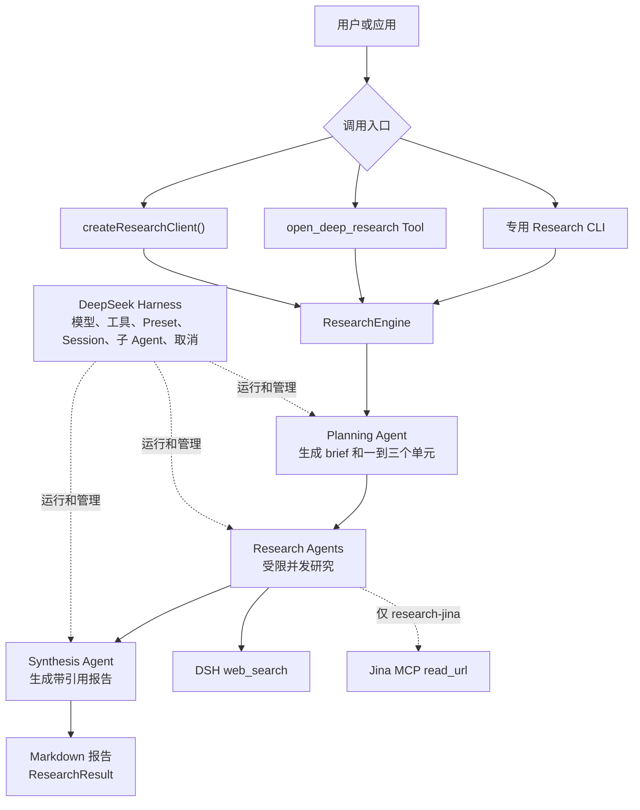

# 🔬 DSH Open Deep Research

[English](./README.md)

DSH Open Deep Research 是一个基于 [DeepSeek Harness](https://github.com/deepseek-ai/deepseek-harness) 的 Deep Research Agent 与 TypeScript 框架。它接收研究问题，生成带引用链接的 Markdown 报告，并通过 CLI、DSH Tool 和程序化 API 提供同一项研究服务。

> **项目状态：** `0.1.0-alpha.4` Public Preview。项目已使用 npm 发布的 DSH `0.1.0-rc.7` 完成测试，通过 GitHub Releases 分发，尚未发布到 npm。

## 核心能力

- 规划一到三个研究单元，通过 DSH 子 Agent 执行，并综合各单元的结果。
- 两个专用 Profile 都支持网页搜索，`research-jina` 还可读取选定网页或 PDF。
- 输出带引用链接的 Markdown 报告、去重后的链接、终止状态与运行元数据。
- 通过可替换的 `ResearchEngine` 提供 CLI、DSH Tool 和 TypeScript 三种入口。

## 🏗️ 架构



三个入口调用同一个 `ResearchEngine`，当前 Profile 决定 Research Agents 可以使用哪些来源工具。生命周期、Profile 组合、配置与结果语义见[架构说明](./docs/architecture.md)。

## 🚀 快速开始

请从 GitHub 下载预发布安装包。需要从源码构建的贡献者可参阅[贡献指南](./CONTRIBUTING.md)。

| Profile         | 来源能力                | 凭证                     | 网络要求                      |
| --------------- | ----------------------- | ------------------------ | ----------------------------- |
| `research-jina` | 网页搜索和网页/PDF 阅读 | DeepSeek Key 与 Jina Key | DeepSeek API 和 `mcp.jina.ai` |
| `research`      | 仅网页搜索              | DeepSeek Key             | DeepSeek API                  |

环境要求：Node.js `^22.19.0` 或 `>=24.0.0`、PATH 中可用的 pnpm `10.x`、DeepSeek Harness `0.1.0-rc.7`。

DSH 使用 `pnpm` 命令管理 Profile 插件，只有 `npx` 还不够。安装前请检查：

```bash
node --version
pnpm --version
```

如果第二条命令不可用，请参考 [pnpm 安装说明](https://pnpm.io/installation)。

### 1. 下载安装包

```bash
curl -fL -O \
  https://github.com/songyang0603/dsh-open-deep-research/releases/download/v0.1.0-alpha.4/dsh-open-deep-research-0.1.0-alpha.4.tgz
```

完成后，当前目录中会出现 `dsh-open-deep-research-0.1.0-alpha.4.tgz`。

### 2. Full Research：搜索并阅读正文（推荐）

`research-jina` 提供网页搜索和正文阅读。它会把选定的公开 URL 发送给 Jina，不会发送浏览器 Cookie。请使用公开且不含敏感信息的 URL，避免签名 URL、依赖登录态的 URL、私有网络 URL 和内网 URL。

设置两把 Key，并检查部署网络能否连接 Jina：

```bash
export DEEPSEEK_API_KEY='<your-deepseek-key>'
export JINA_API_KEY='<your-jina-key>'

curl --connect-timeout 10 --max-time 20 -I \
  'https://mcp.jina.ai/v1?include_tools=read_url&max_tokens=8000'
```

收到任意 HTTP 响应，说明 DNS、TCP 与 TLS 已到达 endpoint。该 endpoint 当前对 `HEAD` 返回 `405 Method Not Allowed`。此检查不会验证 Key，也不会完成 MCP 启动。endpoint 无响应时，请使用下方的 search-only Profile。

DSH rc.7 在 `plugin add` 期间可能显示 host peer warning。如果命令退出码为 `0`，可以继续执行 initializer。

```bash
npx @deepseek-ai/dsh@0.1.0-rc.7 plugin --profile research-jina add \
  ./dsh-open-deep-research-0.1.0-alpha.4.tgz

npx @deepseek-ai/dsh@0.1.0-rc.7 plugin --profile research-jina exec \
  dsh-open-deep-research-init --reader jina

npx @deepseek-ai/dsh@0.1.0-rc.7 --profile research-jina \
  --breadth balanced \
  --language zh-CN \
  "调研 DeepSeek Harness rc.7 的主要变化，搜索相关材料，阅读重要来源正文，并生成带引用链接的报告。"
```

Research Agents 会根据任务选择来源工具，Profile 不会规定固定调用次数。Reader 的返回上限为 8,000 tokens，长文档可能被截断。

### 3. Search-only：只需 DeepSeek Key

没有 Jina Key 或 Jina 网络不可达时，可以使用独立的 `research` Profile。它仍会执行规划、网页搜索、多个研究单元、综合和报告生成，但无法稳定读取网页或 PDF 的完整正文。

`plugin add` 期间也可能出现相同的 rc.7 host peer warning。如果命令退出码为 `0`，可以继续执行 initializer。

```bash
export DEEPSEEK_API_KEY='<your-deepseek-key>'

npx @deepseek-ai/dsh@0.1.0-rc.7 plugin --profile research add \
  ./dsh-open-deep-research-0.1.0-alpha.4.tgz

npx @deepseek-ai/dsh@0.1.0-rc.7 plugin --profile research exec \
  dsh-open-deep-research-init

npx @deepseek-ai/dsh@0.1.0-rc.7 --profile research \
  --language zh-CN \
  "调研 DeepSeek Harness rc.7 的主要变化并生成报告。"
```

### 4. 保存输出

Markdown 模式会把报告写入 stdout，可以直接重定向到文件：

```bash
npx @deepseek-ai/dsh@0.1.0-rc.7 --profile research-jina \
  "比较两种研究方法" > report.md
```

干净环境首次执行 `npx @deepseek-ai/dsh` 时，下载和构建依赖可能需要数分钟，期间输出较少。请等待命令退出后再重试。两个 Profile 相互独立，不会覆盖对方，也不会自动降级。

## ⚙️ 配置

| 参数         | 取值                                                  | 默认值         |
| ------------ | ----------------------------------------------------- | -------------- |
| `--purpose`  | 自由文本                                              | 不设置         |
| `--context`  | 自由文本                                              | 不设置         |
| `--breadth`  | `focused`、`balanced`、`broad`                        | `balanced`     |
| `--format`   | `report`、`brief`、`memo`                             | `report`       |
| `--language` | 语言名称或 locale                                     | 问题使用的语言 |
| `--json`     | 对 `completed` 或 `partial` 输出完整 `ResearchResult` | 关闭           |

breadth 决定研究单元上限，分别为一个、两个或三个，Planning 可以选择更少的单元。模型路由、Preset、工作目录、来源工具 allow-list 和最大研究并发等 Provider 配置见[架构说明](./docs/architecture.md#provider-configuration)。

`completed` 和 `partial` 的退出码为 `0`，`partial` 还会向 stderr 写入简短提示。执行失败使用 `1`，参数错误使用 `2`，用户中断使用 `130`。失败或取消时 stdout 为空。

## 在 DSH 与 TypeScript 中使用

将同一个 tarball 安装到 stock DSH Profile，可以把 `open_deep_research` 作为 Tool 使用：

```bash
npx @deepseek-ai/dsh@0.1.0-rc.7 plugin --profile headless add \
  ./dsh-open-deep-research-0.1.0-alpha.4.tgz

npx @deepseek-ai/dsh@0.1.0-rc.7 plugin --profile web add \
  ./dsh-open-deep-research-0.1.0-alpha.4.tgz
```

stock `headless` 和 `web` 只会获得 Provider 与 Tool，其来源能力由配置的 `allowedTools` 决定。

TypeScript API 可以直接调用当前 `ResearchEngine`：

```ts
import { createResearchClient } from 'dsh-open-deep-research'

const result = await createResearchClient(ctx).run({
  question: 'DeepSeek Harness 如何组合 Agent Preset？',
  purpose: '为插件作者准备架构说明。',
  breadth: 'balanced',
  output: { format: 'report', language: '简体中文' },
})

console.log(result.status)
console.log(result.report)
```

需要取消任务时，可用 `createResearchClient(ctx).start()` 获取 `ResearchRun`。完整 API 行为见[领域契约](./docs/architecture.md#domain-contract)。

## 兼容性与当前限制

| 范围                     | 当前状态                                                                           |
| ------------------------ | ---------------------------------------------------------------------------------- |
| DSH `0.1.0-rc.7`         | 已完成完整离线测试、干净 Profile 组合和打包后的 `research-jina` 真实运行。         |
| Jina Reader              | 已完成真实搜索、正文读取和带引用报告生成，可用性取决于部署网络。                   |
| 文档与工具调用           | 已测试短网页和短 PDF。长输入可能被截断，来源调用次数属于 Prompt 约束。             |
| `ResearchResult.sources` | 最终报告中的 HTTP 链接去重结果。仅有链接不能证明已经读取正文，也不能证明来源质量。 |
| MCP 启动                 | 网络无响应时可能经历多个 SDK timeout。`plugin add` 还可能显示 host peer warning。  |

项目文档：[架构说明](./docs/architecture.md) · [Changelog](./CHANGELOG.md) · [贡献指南](./CONTRIBUTING.md) · [安全策略](./SECURITY.md)

## License

[MIT](./LICENSE)
